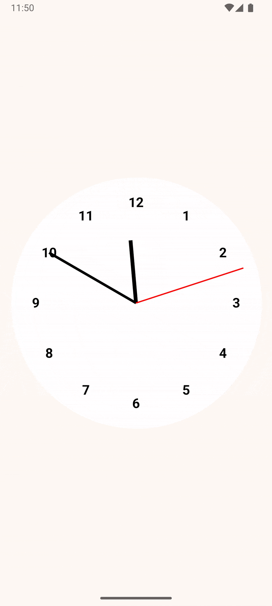

# Jetpack Compose Clock Application

This Android application displays a custom analog clock face built entirely using Jetpack Compose.

## Composables

The clock is constructed using several modular and reusable composable functions:

### 1. `Clockface(modifier: Modifier = Modifier.fillMaxSize())`
- **Purpose**: This is the primary composable that assembles the entire clock.
- **Functionality**:
    - Manages the real-time state for seconds, minutes, and hours.
    - Uses `LaunchedEffect` to update the time every second.
    - Calculates the `x` and `y` coordinates (derived from sine and cosine of the angles) for each hand based on the current time.
    - Renders the clock's visual components by calling `Background`, `Dials`, and `Hand` composables.
    - Encased in a `Surface` with a `CircleShape` and padding, and a `drawBehind` modifier to draw an additional decorative circle (currently red).

### 2. `Background(modifier: Modifier, primary: Color, secondary: Color, brushColors: List<Color>, brush: Brush)`
- **Purpose**: Draws the circular background of the clock face.
- **Functionality**:
    - Takes a `modifier` to control its layout (typically `fillMaxSize`).
    - Draws a circle using a `Brush` (defaulting to a linear gradient of `primary` and `secondary` colors, which themselves default to white).
    - The circle's radius is determined by the smaller dimension of the available canvas size, ensuring it fits within its bounds.

### 3. `Dials(modifier: Modifier, ...)`
- **Purpose**: Renders the hour numerals (1 through 12) on the clock face.
- **Functionality**:
    - Uses a `Canvas` that fills its maximum size.
    - Calculates the positions for each numeral based on a `numbersRadiusFactor` (e.g., 80% of the main radius) to place them inside the clock's edge.
    - Correctly determines the angle for each hour (1 to 12) to ensure 12 is at the top, 3 to the right, etc.
    - Uses `rememberTextMeasurer` and `drawText` to render the numerals, ensuring they are centered at their calculated positions.
    - Numerals are styled with a specific font size and weight.
    - *Note: The `primary`, `secondary`, `brushColors`, and `brush` parameters are currently defined but not used for drawing the numerals themselves.*

### 4. `Hand(x: Double, y: Double, modifier: Modifier, primary: Color, secondary: Color, brushColors: List<Color>, brush: Brush, strokeWidth: Float, lengthFactor: Float)`
- **Purpose**: Draws a single clock hand (e.g., hour, minute, or second).
- **Functionality**:
    - Takes `x` and `y` values (normalized coordinates, typically `sin(angle)` and `-cos(angle)`) which define the direction of the hand.
    - `lengthFactor` parameter (defaults to `1.0f`) controls the length of the hand relative to the clock's radius (e.g., `0.5f` for half length). This factor is coerced to be between `0f` and `1f`.
    - `strokeWidth` controls the thickness of the hand.
    - Draws a line from the center of the canvas to the calculated end point.
    - Uses a `Brush` for the line's color (defaulting to a linear gradient).

### 5. `GreetingPreview()`
- **Purpose**: A standard Jetpack Compose preview function.
- **Functionality**:
    - Allows developers to see a preview of the `Clockface` composable within Android Studio's design/preview pane.
    - Wraps `Clockface` in `MyApplicationTheme`.

## Preview

## How it Works
The `Clockface` composable acts as the central coordinator. It continuously updates the time and recalculates the positions for the hour, minute, and second hands. It then passes these dynamic values, along with modifiers and styling information, to the `Hand` composable for rendering each hand. The `Background` and `Dials` composables are called to draw the static parts of the clock.

The entire UI is reactive, meaning that whenever the state variables (time-derived coordinates) change, only the necessary parts of the UI (primarily the hands) are recomposed and redrawn.
